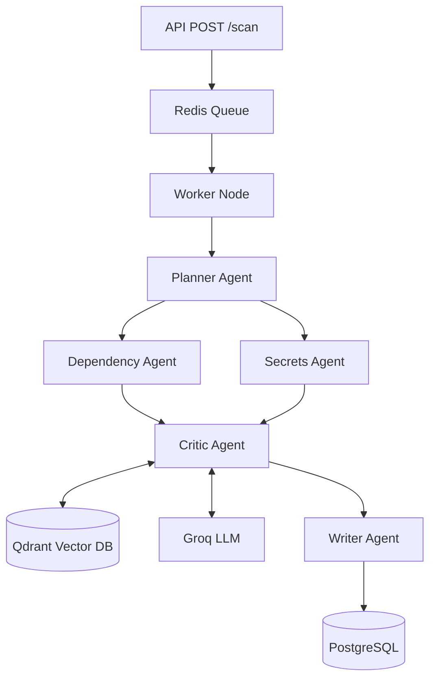

# AuditAgent

AuditAgent is an automated, AI-driven security auditing framework. It performs deep, contextual scans on codebases to find vulnerabilities, misconfigurations, and leaked secrets.

By utilizing a Retrieval-Augmented Generation (RAG) agentic workflow, it dramatically reduces false positives compared to traditional Static Application Security Testing (SAST) tools. 

## Architecture

AuditAgent uses a LangGraph-based multi-agent architecture. Jobs are submitted via FastAPI, queued in Redis, and executed by a background worker.



- **Planner Agent**: Analyzes repository structure (languages, package managers) to orchestrate downstream workers.
- **Dependency & Secrets Agents** *(Parallel)*: Extracts potential findings from lockfiles, source code, and git history.
- **Critic Agent**: A senior auditor LLM agent. It pulls context from Qdrant, verifies each finding, and weeds out false positives (e.g. test fixtures vs live keys).
- **Writer Agent**: Compiles the verified findings into a finalized, readable Markdown report.

## Setup

1. Copy `.env.example` to `.env` and configure your API keys (e.g., `GROQ_API_KEY`).
2. Run the environment:

```bash
docker-compose up -d --build
```

3. Seed the local Qdrant instance with vulnerability definitions:

```bash
docker exec -it auditagent-worker-1 python scripts/seed_qdrant.py
```

## Usage

Submit a repository for auditing via the REST API:

```bash
curl -X POST http://localhost:8000/api/v1/scan \
     -H "Content-Type: application/json" \
     -H "X-API-Key: default-dev-key" \
     -d '{"repo_url": "https://github.com/octocat/Hello-World.git"}'
```

You will receive a `job_id`. You can poll the status and fetch the report:

```bash
curl -H "X-API-Key: default-dev-key" http://localhost:8000/api/v1/scan/<job_id>
```

Alternatively, use the built-in python script:
```bash
python tests/test_scan.py
```

## Known Limitations
- The Critic Agent's accuracy is heavily dependent on the chosen LLM and the prompt engineering.
- Deep historical git scanning on massive mono-repos (10+ GB) can lead to timeouts. The `MAX_REPO_SIZE_BYTES` limit is enforced to prevent this.
- Does not currently support fully air-gapped internal source control systems without Docker network reconfiguration.
